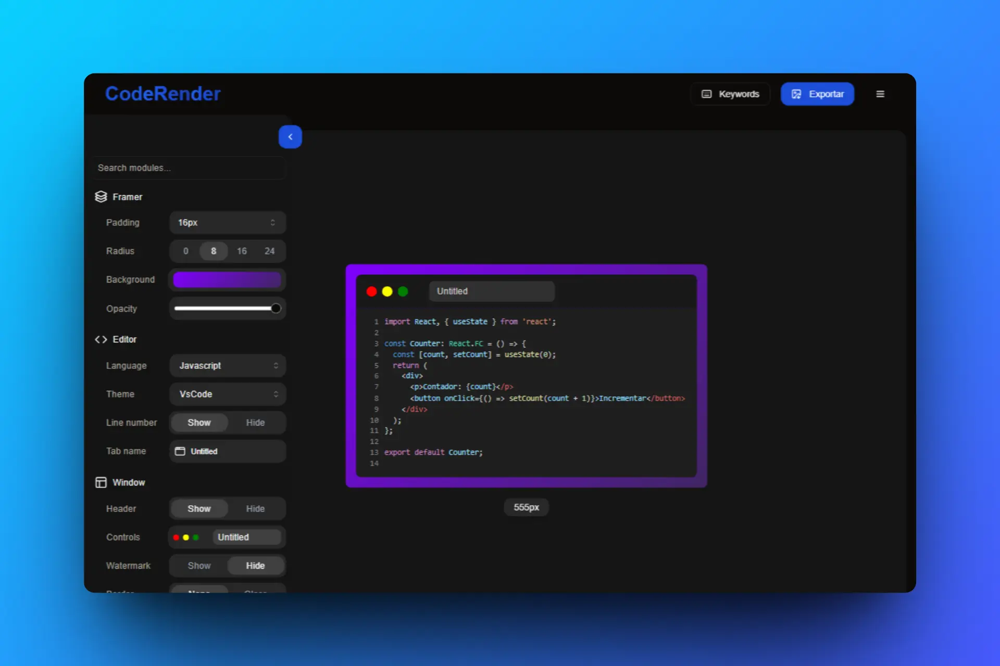

# CodeRender ✨

Crea y comparte imágenes de tu código con un aspecto increíble. CodeRender es una herramienta web que te permite transformar tus fragmentos de código en imágenes elegantes y personalizables, listas para compartir en redes sociales, blogs o en tu documentación.



## 🚀 Características

CodeRender te ofrece un control total sobre la apariencia de tu código:

-   🎨 **Temas**: Elige entre una amplia variedad de temas para el editor, incluyendo Dracula, VS Code, Tokyo Night, y muchos más.
-   ↔️ **Estilos de Ventana**: Personaliza la cabecera de la ventana con diferentes estilos, desde el minimalista hasta la apariencia de terminal de macOS.
-   🖋️ **Fuentes**: Ajusta la familia y el grosor de la fuente para encontrar el estilo que más te guste.
-   🌈 **Fondos**: Configura fondos con colores sólidos o gradientes y ajusta su opacidad.
-   🖼️ **Marco**: Controla el padding, radio de los bordes y la visibilidad de la sombra para enmarcar tu código perfectamente.
-   ⚙️ **Editor**: Muestra u oculta los números de línea y personaliza el nombre del archivo en la pestaña.
-   💧 **Marca de agua**: Añade una marca de agua a tus creaciones.
-   📥 **Exportación**: Exporta tus creaciones como imágenes PNG, listas para usar.

## 🛠️ Tecnologías Utilizadas

Este proyecto está construido con un stack moderno de tecnologías web:

-   **Framework**: [Next.js](https://nextjs.org/)
-   **Librería UI**: [React](https://react.dev/)
-   **Gestión de Estado**: [Redux Toolkit](https://redux-toolkit.js.org/)
-   **Estilos**: [Tailwind CSS](https://tailwindcss.com/)
-   **Componentes UI**: [shadcn/ui](https://ui.shadcn.com/)
-   **Editor de Código**: [CodeMirror](https://codemirror.net/)
-   **Animaciones**: [Framer Motion](https://www.framer.com/motion/)
-   **Exportación a Imagen**: [html-to-image](https://github.com/bubkoo/html-to-image)
-   **Lenguaje**: [TypeScript](https://www.typescriptlang.org/)

## 🏁 Cómo Empezar

Para ejecutar este proyecto en tu entorno de desarrollo local, sigue estos pasos:

1.  **Clona el repositorio:**
    ```bash
    git clone https://github.com/tu-usuario/coderender.git
    cd coderender
    ```

2.  **Instala las dependencias:**
    ```bash
    npm install
    # o
    # yarn install
    # o
    # pnpm install
    ```

3.  **Ejecuta el servidor de desarrollo:**
    ```bash
    npm run dev
    # o
    # yarn dev
    # o
    # pnpm dev
    ```

Abre [http://localhost:3000](http://localhost:3000) en tu navegador para ver la aplicación.
